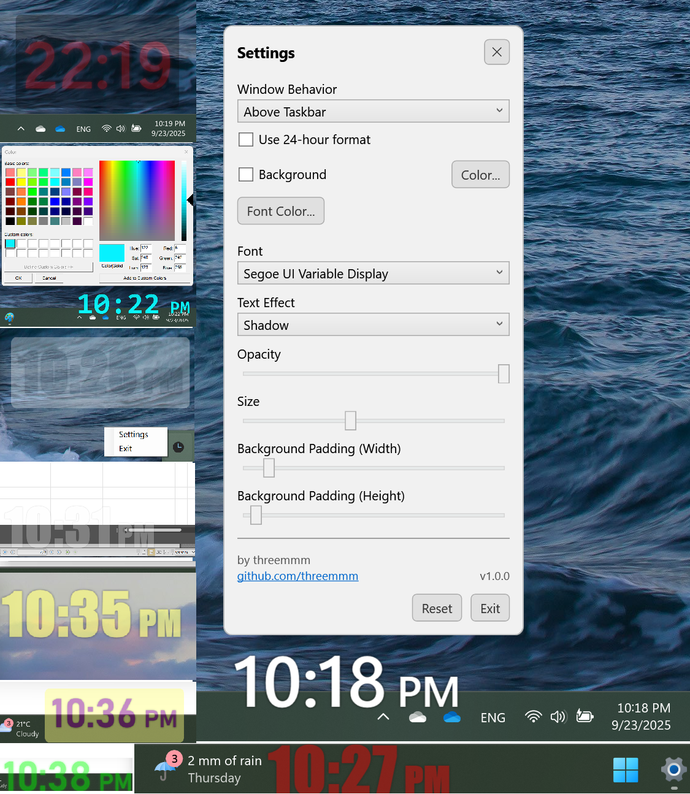

# 3MClock

A small frameless desktop clock for Windows. Always on top, with quick settings. Originally developed to meet my own need for an always-on-top clock, and released as free, open-source software (MIT).

---

## Features

- **Window Behavior:** Choose from three modes:
    * **Normal:** Behaves like a standard window.
    * **Always on Top:** Stays above other applications (not the taskbar).
    * **Above Taskbar:** Keeps the clock visible over everything, including the taskbar.
- Right click menu: Settings, Exit
- System tray icon
  - Right click: Settings, Exit
  - Double click: bring clock to front
- 12h or 24h time format
- Text color picker
- Optional background with color picker
- Single opacity slider that fades the whole clock layer
- Remembers settings between runs

## Download
Get the latest build from the Releases page and run `3MClock.exe`. No installer required.

## Usage
- Drag the clock to move it.
- Right click the clock or tray icon for Settings.
- Toggle Always on top as needed.

## Build from source
- Windows 10 or 11
- .NET 8 SDK
- Visual Studio 2022 or `dotnet build -c Release`

## Screenshot

## Attribution
- This project was primarily generated with assistance from Google Gemini (Pro 2.5).  
- Final code was reviewed, tested, and released by the maintainer.

## License
This project is licensed under the MIT License.